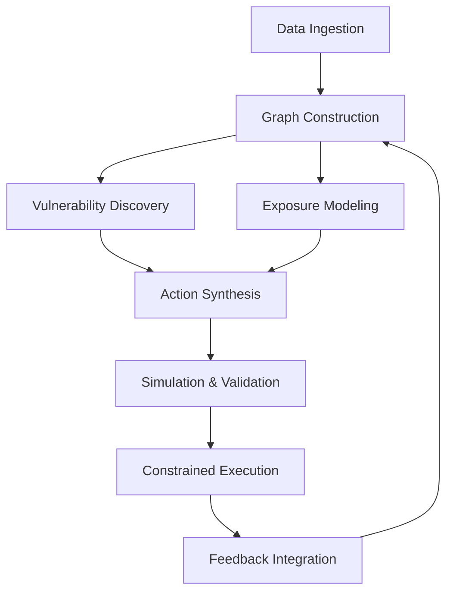

# Continuous Security Optimization Systems (CSOS):

## A Formal Architecture for Deterministic–Adaptive Cyber Defense at Machine Scale

**Authors**
AXIOM LLC Research Team

**Affiliation**
AXIOM LLC Research Division

---

## Abstract

Cybersecurity systems are increasingly misaligned with the scale, velocity, and structural complexity of modern computing environments. Existing paradigms rely on periodic assessment, manual prioritization, and fragmented tooling, resulting in persistent exposure windows and suboptimal resource allocation. This paper introduces **Continuous Security Optimization Systems (CSOS)** as a generalized class of architectures that reconceptualize cybersecurity as a real-time, closed-loop optimization problem over a dynamically evolving system state.

CSOS integrates heterogeneous data ingestion, canonical asset graph construction, vulnerability discovery, action synthesis, simulation-based validation, and constrained execution within a unified framework. The core contribution is a **deterministic–adaptive hybrid model** in which probabilistic inference and learning operate within strictly bounded execution environments that guarantee reproducibility, auditability, and policy compliance. This resolves a fundamental tension in autonomous systems between adaptability and operational safety.

We formalize CSOS as a constrained partially observable Markov decision process (POMDP) defined over a continuously updated graph representation of assets, identities, and relationships. Optimization objectives are expressed in terms of minimizing expected systemic risk under latency and resource constraints. Analytical treatment demonstrates that CSOS induces structural transformations in cybersecurity operations, including compression of remediation latency, redefinition of security as a graph optimization problem, and concentration of risk within identity and privilege topologies.

Scaling analysis indicates that system performance exhibits superlinear improvement due to feedback-driven learning and graph expansion, while remaining bounded by observability, simulation fidelity, and adversarial dynamics. This work establishes a rigorous theoretical foundation for continuous, machine-scale cybersecurity systems and outlines key directions for future research in formal verification, privacy-preserving optimization, and distributed security intelligence.

---

## Keywords

Continuous Cybersecurity, Attack Graphs, Deterministic Systems, Reinforcement Learning, Security Optimization, Graph Theory, Identity Security

---

## 1. Introduction

The dominant paradigms of cybersecurity remain rooted in assumptions that no longer hold under contemporary conditions. Systems are evaluated periodically, vulnerabilities are triaged manually, and remediation is applied asynchronously relative to discovery. These practices implicitly assume that system state evolves slowly and that human operators can maintain sufficient situational awareness. In reality, software systems exhibit high-frequency change, complex interdependencies, and global exposure, rendering such assumptions invalid.

Continuous Security Optimization Systems (CSOS) address this misalignment by reframing cybersecurity as a **persistent optimization process over system state**, rather than a sequence of discrete interventions. The central premise is that system security can be expressed as a function over a structured representation of assets and relationships, and that this function can be continuously minimized through automated observation, reasoning, and action.

A key limitation of prior approaches lies in the dichotomy between adaptive and deterministic systems. Machine learning–driven systems offer adaptability but lack guarantees of correctness or reproducibility, while deterministic systems provide guarantees but lack the capacity for dynamic reasoning. CSOS resolves this tension through architectural separation: probabilistic components generate candidate actions and update policies, while execution is constrained to deterministic, verifiable transformations. This separation ensures that system behavior remains auditable and policy-compliant without sacrificing adaptability.

This paper formalizes the CSOS paradigm, defines its mathematical structure, analyzes its scaling behavior, and examines its implications for cybersecurity as a discipline.

---

## 2. Literature Review

The conceptual foundation of CSOS draws from several domains, including program analysis, graph-based security modeling, reinforcement learning, and autonomous systems.

Vulnerability discovery techniques such as static analysis and abstract interpretation [1], fuzzing [2], and symbolic execution [3] have demonstrated effectiveness in identifying software defects. However, these approaches are typically applied in isolation and lack integration into continuous operational frameworks. Automated exploit generation systems [4][5] extend these techniques but remain constrained by brittleness and limited environmental generalization.

Attack graphs [6][7] provide a formal mechanism for representing system vulnerabilities and exploit pathways. Subsequent work incorporating probabilistic reasoning [8] improves expressiveness but introduces computational complexity and often assumes static system structure. CSOS generalizes this concept by introducing a continuously evolving graph representation with embedded optimization objectives.

Reinforcement learning has been explored for adaptive cybersecurity strategies [9][10], enabling dynamic policy learning under uncertainty. However, such systems often suffer from instability, lack of interpretability, and difficulty in enforcing safety constraints. These limitations have restricted their deployment in high-assurance environments.

Autonomous cyber defense systems, including those demonstrated in competitive settings [11], have shown the feasibility of end-to-end automation. Nonetheless, these systems are typically constrained to simplified environments and lack integration with real-world operational constraints.

Finally, deterministic execution frameworks [12] have emerged as a response to the unpredictability of AI-driven systems, emphasizing reproducibility, auditability, and structured outputs. CSOS incorporates this paradigm as a foundational constraint, ensuring that all externally observable actions are verifiable.

---

## 3. Formal Architecture of Continuous Security Optimization Systems

### 3.1 System Model

CSOS is formalized as a constrained partially observable Markov decision process:

[
\mathcal{M} = (S, A, T, R, O, \Omega, \gamma, \Pi)
]

where ( \Pi ) represents a set of execution constraints that enforce safety, determinism, and policy compliance. The system operates over discrete time steps, although in practice it approximates continuous operation through high-frequency iteration.

---

### 3.2 State Representation

The system state is represented as a time-indexed graph:

[
G_t = (V_t, E_t, \Phi_t)
]

where ( V_t ) denotes assets (including hosts, services, identities, and code artifacts), ( E_t ) denotes relationships (such as network reachability, trust, and privilege), and ( \Phi_t ) denotes attributes associated with nodes and edges, including vulnerabilities, configurations, and behavioral metrics.

This representation enables the unification of traditionally disparate security domains—network security, application security, and identity security—within a single analytical framework.

---

### 3.3 Objective Function

The system seeks to minimize expected cumulative risk:

[
\min_{\pi} \mathbb{E} \left[ \sum_{t=0}^{T} \gamma^t \cdot R(G_t, a_t) \right]
]

where the reward function ( R ) is defined as the negative of a risk functional incorporating vulnerability severity, exploitability, and graph-theoretic centrality measures. This formulation captures both local vulnerabilities and systemic exposure arising from graph structure.

---

### 3.4 Architectural Composition



The architecture is organized as a closed-loop system in which each component contributes to iterative refinement of system state and policy.

---

### 3.5 Functional Components

Data ingestion aggregates heterogeneous inputs, including telemetry, configuration data, dependency graphs, and vulnerability disclosures. These inputs are normalized into the canonical graph representation, ensuring consistency across domains.

The discovery component identifies potential vulnerabilities through a combination of static and dynamic analysis techniques. Its effectiveness is governed by a coverage–efficiency trade-off, wherein computational resources are allocated to maximize expected vulnerability yield.

Action synthesis transforms identified vulnerabilities and graph structures into candidate remediation or containment actions. These actions are generated through structured reasoning processes that incorporate both learned patterns and domain-specific constraints.

Simulation and validation provide a controlled environment for evaluating candidate actions. This layer is critical for filtering unsafe or ineffective actions prior to execution, thereby reducing operational risk.

Execution is strictly constrained to deterministic transformations that satisfy predefined schemas and policies. This ensures reproducibility and auditability of all system actions.

Feedback integration updates system policies based on observed outcomes, enabling both short-term adaptation and long-term learning.

---

### 3.6 Execution Dynamics

The operational loop of CSOS can be expressed as:

```pseudo
loop:
    observe environment
    update graph state

    identify vulnerabilities
    generate candidate actions

    validate via simulation
    enforce execution constraints

    execute actions
    observe outcomes

    update policies
```

This loop operates continuously, approximating real-time optimization of system security posture.

---

## 4. Analysis and Discussion

### 4.1 Scaling Properties

CSOS exhibits superlinear performance characteristics arising from the interaction of graph expansion and feedback learning. As the system acquires more information about the environment, its internal representation becomes increasingly accurate, enabling more efficient allocation of computational resources and more effective action synthesis.

The presence of credential reuse and shared dependencies further amplifies this effect, as individual discoveries can propagate across multiple nodes within the graph.

---

### 4.2 Structural Transformation of Cybersecurity

The introduction of CSOS induces a shift from vulnerability-centric to **structure-centric security analysis**. Risk is no longer dominated by isolated software defects but by the topology of the system itself, particularly the distribution of privileges and trust relationships.

This shift has significant implications for both defensive strategy and system design, emphasizing the importance of minimizing unnecessary connectivity and enforcing strict access controls.

---

### 4.3 Identity and Privilege as Primary Risk Drivers

Empirical observations and theoretical analysis converge on the conclusion that identity systems constitute the dominant risk surface in complex environments. Privilege escalation pathways and credential reuse create high-leverage attack vectors that are not adequately addressed by traditional vulnerability management.

CSOS explicitly models these relationships within the graph structure, enabling targeted optimization of identity and access configurations.

---

### 4.4 Latency as a First-Class Variable

A central insight of this work is that **latency in detection and remediation is a primary determinant of system risk**. As discovery mechanisms approach real-time operation, any delay in response directly translates into exploitable exposure.

CSOS minimizes this latency through continuous operation and automated execution, effectively collapsing the window between discovery and remediation.

---

### 4.5 Limitations

Despite its advantages, CSOS is subject to several constraints. Partial observability limits the completeness of the system model, while simulation fidelity constrains the accuracy of validation processes. Adversarial adaptation introduces non-stationarity into the environment, complicating policy optimization. Additionally, data sensitivity and privacy considerations restrict the availability of certain information, potentially reducing system effectiveness.

---

## 5. Conclusion and Future Research Directions

Continuous Security Optimization Systems represent a fundamental redefinition of cybersecurity as an ongoing optimization problem rather than a reactive process. By integrating adaptive reasoning with deterministic execution, CSOS provides a framework for achieving both flexibility and control in complex environments.

Future research should focus on formal verification of system policies, enabling provable guarantees of safety and correctness. The development of federated graph models could allow multiple organizations to share insights without exposing sensitive data, while advances in privacy-preserving computation may enable more comprehensive analysis under regulatory constraints. Additionally, further work is needed to address adversarial adaptation and to develop robust mechanisms for maintaining system stability in dynamic environments.

---

## References

[1] Cousot, P., & Cousot, R. (1977). Abstract interpretation.
[2] Zalewski, M. (2014). American Fuzzy Lop.
[3] King, J. (1976). Symbolic execution and program testing.
[4] Avgerinos, T. et al. (2011). Automatic exploit generation. IEEE S&P.
[5] Shoshitaishvili, Y. et al. (2016). SoK: (State of) The Art of War.
[6] Sheyner, O. et al. (2002). Automated generation of attack graphs.
[7] Noel, S., & Jajodia, S. (2004). Managing attack graph complexity.
[8] Poolsappasit, N. et al. (2012). Bayesian attack graphs.
[9] Nguyen, T. et al. (2020). Deep reinforcement learning for cybersecurity.
[10] Han, Z. et al. (2021). RL-based adaptive defense.
[11] DARPA Cyber Grand Challenge (2016).
[12] Deterministic AI Systems (2023).
[13] NIST SP 800-207 (Zero Trust Architecture).
[14] Wu, Z. et al. (2020). Graph neural networks: A review.
[15] Behl, J. & Behl, K. (2022). Identity threat detection.
[16] Humble, J. & Farley, D. (2011). Continuous delivery.
[17] OWASP Top 10 (2021).
[18] Cloud Security Alliance (2023).

---

## Publication & Dissemination Notes

* **Suggested Title Variant:** “Continuous Security Optimization Systems: A Deterministic–Adaptive Framework for Cyber Defense”
* **arXiv Categories:** cs.CR, cs.AI, cs.SY
* **Keywords for Indexing:** continuous cybersecurity, attack graph optimization, deterministic AI, identity security
* **Repository Path:** `/axiom-research/csos-formal-paper.md`
* **Next Steps:** internal review, empirical validation expansion, submission to IEEE S&P / ACM CCS / arXiv
